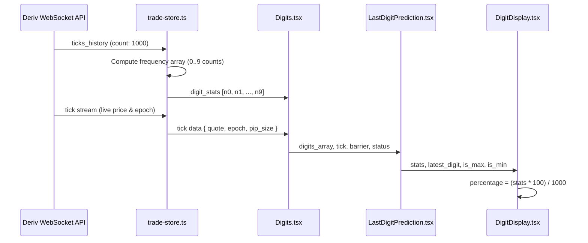

# Digit Distribution Bubbles Architecture & Integration Guide

The **Digit Distribution Bubbles** component is an interactive statistical visualization in DTrader that calculates and renders the frequency distribution of the last digits (`0` through `9`) across the most recent 1000 market ticks.

It allows traders executing **Digits contracts** (Matches/Differs, Over/Under, Even/Odd) to analyze tick frequency patterns in real-time, identify statistical outliers ("Hot" and "Cold" digits), and select barrier predictions directly from the chart overlay.

---

## 1. Component Hierarchy & File Structure

All source files for the digit distribution system are housed in `@deriv/trader`:

```
packages/trader/
├── src/
│   ├── Modules/
│   │   └── Contract/
│   │       └── Components/
│   │           ├── Digits/
│   │           │   └── digits.tsx                   # Top-level wrapper & WebSocket stream bridge
│   │           └── LastDigitPrediction/
│   │               ├── index.ts                     # Module barrel export
│   │               ├── last-digit-prediction.tsx     # Grid container for digits 0–9
│   │               ├── digit-display.tsx            # Single digit bubble controller
│   │               ├── last-digit-stat.tsx          # SVG circular percentage gauge
│   │               ├── digit.tsx                    # Value & percentage label badge
│   │               ├── digit-spot.tsx               # Active tick spot pill overlay
│   │               └── last-digit-pointer.tsx       # Live pointer tracking incoming ticks
│   └── sass/
│       └── app/
│           └── modules/
│               └── contract/
│                   └── digits.scss                  # SCSS styling & animations
```

---

## 2. Data Flow & Lifecycle



### 2.1 Frequency & Percentage Calculation
- **Sample Window**: 1000 consecutive ticks from the active underlying symbol.
- **Frequency Array (`digit_stats`)**: `[count_0, count_1, count_2, ..., count_9]`.
- **Percentage Formula**:
  $$\text{Percentage}_d = \frac{\text{Count}_d \times 100}{1000} = \frac{\text{Count}_d}{10}\%$$
- **Outlier Highlights**:
  - **Max (Hot Digit)**: `is_max = Math.max(...digit_stats) === stats` (Highlighted with Emerald Gradient).
  - **Min (Cold Digit)**: `is_min = Math.min(...digit_stats) === stats` (Highlighted with Crimson Gradient).

---

## 3. Component Props & API Reference

### `<LastDigitPrediction />`

| Prop | Type | Description |
| :--- | :--- | :--- |
| `digits` | `number[]` | 10-element frequency count array from the trading store. |
| `digits_info` | `Record<number, { digit: number; spot: string }>` | Map of recent spot timestamps to digit values. |
| `dimension` | `number` | Width/spacing dimension per digit slot (e.g. `52` desktop, `64` mobile). |
| `barrier` | `number \| null` | Currently active contract target digit barrier. |
| `selected_digit` | `number` | User-selected digit in trade parameters. |
| `contract_type` | `string` | Active contract type (`DIGITMATCH`, `DIGITDIFF`, `DIGITOVER`, `DIGITUNDER`, `DIGITODD`, `DIGITEVEN`). |
| `onDigitChange` | `(event: { target: { name: string; value: number } }) => void` | Callback triggered when user clicks/taps a digit bubble. |
| `status` | `'won' \| 'lost' \| null` | Open contract status for trade outcome animations. |
| `tick` | `TickSpotData` | Live tick stream object containing latest quote and epoch. |
| `is_digit_contract` | `boolean` | `true` when a digit trade contract is actively being viewed. |

---

### `<DigitDisplay />`

| Prop | Type | Description |
| :--- | :--- | :--- |
| `value` | `number` | The digit number represented by this bubble (`0` through `9`). |
| `stats` | `number \| null` | Raw count of occurrences for this digit in the 1000-tick window. |
| `latest_digit` | `{ digit: number; spot: string }` | The last digit and full price spot of the most recent market tick. |
| `is_max` | `boolean` | `true` if this digit is the most frequent in the sample window. |
| `is_min` | `boolean` | `true` if this digit is the least frequent in the sample window. |
| `is_won` | `boolean` | `true` if the contract settled winning on this digit. |
| `is_lost` | `boolean` | `true` if the contract settled losing on this digit. |
| `onSelect` | `(value: number) => void` | Selection handler for interactive contract types. |

---

## 4. Visual State Machine

Each digit bubble dynamically transitions through the following visual states:

```
┌─────────────────────────────────────────────────────────────┐
│                       BUBBLE STATES                         │
├─────────────────┬───────────────────────────────────────────┤
│ Default         │ Neutral circle with soft percentage ring  │
├─────────────────┼───────────────────────────────────────────┤
│ Latest Tick     │ Scaled 1.2x with green pulse glow         │
├─────────────────┼───────────────────────────────────────────┤
│ Hot / Max       │ Emerald gradient ring (#10B981) + glow    │
├─────────────────┼───────────────────────────────────────────┤
│ Cold / Min      │ Crimson gradient ring (#EF4444) + glow    │
├─────────────────┼───────────────────────────────────────────┤
│ Selected        │ Brand primary accent ring (#3B82F6 / #118e1c)│
├─────────────────┼───────────────────────────────────────────┤
│ Winning Spot    │ Exploding particles + Success background  │
├─────────────────┼───────────────────────────────────────────┤
│ Losing Spot     │ Danger border + Loss background           │
└─────────────────┴───────────────────────────────────────────┘
```

---

## 5. How to Integrate or Replace the Component

If you want to plug in a completely custom Digit Distribution UI or extend the existing one:

### Step 1: Retain the Container Contract
In [`packages/trader/src/Modules/Contract/Components/LastDigitPrediction/index.ts`](file:///E:/Backup/phub/main%20profithub%20d/packages/trader/src/Modules/Contract/Components/LastDigitPrediction/index.ts), export your container conforming to `TLastDigitPrediction`:

```tsx
import LastDigitPrediction from './last-digit-prediction';
export { LastDigitPrediction };
```

### Step 2: Use the Shared Store Hooks
To access digit statistics anywhere in the trading interface:

```tsx
import { useTraderStore } from 'Stores/useTraderStores';

const MyDigitComponent = () => {
    const { digit_stats, last_digit, onChange } = useTraderStore();
    
    // digit_stats is number[10] representing counts for digits 0-9
    return (
        <div>
            {digit_stats.map((count, digit) => (
                <button key={digit} onClick={() => onChange({ target: { name: 'last_digit', value: digit } })}>
                    Digit {digit}: {(count / 10).toFixed(1)}%
                </button>
            ))}
        </div>
    );
};
```

---

## 6. Styling & Theme Tokens

The component consumes CSS variables defined by the white-label theme engine:

- `--color-surface-primary`: Bubble background in light/dark mode.
- `--color-text-primary`: Bold digit number color.
- `--color-text-secondary`: Percentage text color.
- `--brand-primary`: Selected barrier border and glow accent.
- `--color-text-success`: Win state and highest frequency stroke.
- `--color-text-danger`: Loss state and lowest frequency stroke.
